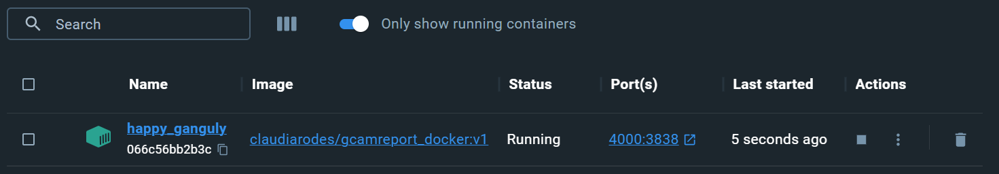

# gcamreport
  

[](https://github.com/bc3LC/gcamreport/actions/workflows/docs.yaml)
[](https://github.com/bc3LC/gcamreport/actions/workflows/pages/pages-build-deployment)
[](https://github.com/bc3LC/gcamreport/actions/workflows/test_coverage.yml)
[](https://codecov.io/gh/bc3LC/gcamreport)
[](https://github.com/bc3LC/gcamreport/actions/workflows/docker_impl.yaml)
[](https://github.com/bc3LC/gcamreport/actions/workflows/build.yaml)
  

<!-- ------------------------>
<!-- ------------------------>
## <a name="contents"></a>Contents
<!-- ------------------------>
<!-- ------------------------>

  
- [Contents](#contents)

- [Introduction](#introduction)

- [Installation Guide](#installation-guide)

	- [With R](#with-r)

	- [With Docker](#with-docker)

- [Getting Started](#get-started)

- [Known Errors and Workarounds](#bugs)

  

  

<!-- ------------------------>
<!-- ------------------------>
## <a name="introduction"></a>Introduction
<!-- ------------------------>
<!-- ------------------------>  

[Back to Contents](#contents)
   

`gcamreport` is a tool that generates a consistent dataset from any scenario run by the Global Change Analysis Model ([GCAM](http://www.globalchange.umd.edu/gcam/)), which meets the reporting requirements of the Intergovernmental Panel on Climate Change ([IPCC](https://www.ipcc.ch/)). Additionally, `gcamreport` includes an interactive user widget that allows users to create and download plots, as well as download reduced versions of the dataset in table format.

  
<!-- ------------------------>
<!-- ------------------------>  
## <a name="installation-guide"></a>Installation Guide
<!-- ------------------------>
<!-- ------------------------>  

[Back to Contents](#contents)
  

There are two equivalent possibilities to make use of this package:

### <a name="with-R"></a>With R

1. Requirements

	- [R](https://www.r-project.org/)

	- [Rstudio](https://www.rstudio.com/)

	- [Git](https://git-scm.com/downloads/)


2. Clone this repository:  

```bash
git clone  https://github.com/bc3LC/gcamreport.git
```

3. Open the `gcamreport` folder you just cloned and double-click the `gcamreport.Rproj` file. RStudio should open the project. Load the library:

```r
install.packages('devtools')
devtools::load_all()
```
 Now `gcamreport` package is fully loaded. Enjoy! :smile:

  
<br>

### <a name="with-Docker"></a>With Docker

  

1. Requirements

	- [Docker](https://docs.docker.com/get-docker/)

	- [Git](https://git-scm.com/downloads)

  
2. Clone this repository:

```bash
git clone https://github.com/bc3LC/gcamreport.git
```

3. Open Docker Desktop: double click the icon on your computer.

4. Pull the Docker image. Inside a terminal (bash or cmd) pull the docker image:

```bash
docker pull claudiarodes/gcamreport_docker:v1
```
  
5. Run the Docker container: 
```bash
docker run -v /path/to/gcamreport:/app -p 4000:3838 -it claudiarodes/gcamreport_docker:v1
```
This should prompt an R terminal in your console.
  

6. Install the `gcamreport` package in the new R console:

```r
remotes::install_github("bc3LC/gcamreport") #you can skip all updates in case you are asked
library(gcamreport)
```
**Note**:exclamation:: the local files to be accessed must be inside the `gcamreport` folder, which is considered now as the root directory of the R session. Inside the R session, it is referred to as `/app`. 

**Note**:exclamation:: to open the shiny app, either go to Docker Desktop and type the last started port, or type http://localhost:4000 in the browser.

**Note**:exclamation:: to use again the docker image, you can simply run steps 3, 5 and 6, since the docker image is already on your computer.

Now `gcamreport` package is fully loaded. Enjoy! :smile:

  
<br>

  
<!-- ------------------------>
<!-- ------------------------> 
## <a name="get-started"></a>Getting Started
<!-- ------------------------>
<!-- ------------------------>

[Back to Contents](#contents)
  

The package consists of a set of functions divided into two different blocks:


- Dataset generation: it creates or loads an existing project and automatically saves the generated dataset that meets the reporting requirements of [IPCC](https://www.ipcc.ch/). Main function: `run()`. For more information look at this [tutorial](https://bc3lc.github.io/gcamreport/articles/Dataset_Generation_Tutorial.html).


- Interactive user block: it launches an interactive widget to display in table format the dataset, with the possibility to filter, reorder, and download live. Moreover, it displays and downloads plots, aggregated by variables, regions, and scenarios. Main function: `launch_gcamreport_app()`. For more information look at this [tutorial](https://bc3lc.github.io/gcamreport/articles/Interactive_UI_Tutorial.html)
  

In addition, the package includes some default input files (.Rda), that are read by the different functions. These can be changed by the user. Some of these constants include energy shares, land shares, and others.


<br>

<!-- ------------------------>
<!-- ------------------------>
## <a name="bugs"></a>Known Errors and Workarounds
<!-- ------------------------>
<!-- ------------------------>  
  
[Back to Contents](#contents)


Some typical and already-known errors that can be easily solved! :bulb:

:computer: Error on `run("path/to/your/data/myData.dat")`

In your R console, you might see this error:

```
> run("path/to/your/data/myData.dat")
[1] "Loading project..."
[1] "Loading data, performing checks, and saving output..."
[1] "ag_demand_clean"
Error in rgcam::getQuery(prj, "demand balances by crop commodity") :
  getQuery: Query demand balances by crop commodity is not in any scenarios in the data set.
```

This problem is due to a wrong path specification.

**Possible solution**: make sure that you specified correctly the path. In addition:

 - In case you are using `gcamreport` package following the [R installation](#with-r), try to copy the whole path to your data, for instance `C:\Users\username\Documents\path\to\your\data\myData.dat` if you are using a Windows distribution.
 
 - In case you are using `gcamreport` package following the [Docker installation](#with-docker):
 
 	 a) make sure that your data is inside the `gcamreport` folder.
	 
 	 b) make sure that you type correctly the path to your `gcamreport` folder when running the docker image (5th step in the [Docker section](#with-docker))
	 
 	 c) make sure that you are pointing correctly to your data. For example, if in the `gcamreport` folder you have a folder called `amazingData` with your dataset `myData.dat`, you should refer to it as
	 
```r
# option 1: full path
run("/app/amazingData/myData.dat")

# option 2: partial path
run("amazingData/myData.dat")
```

<br>

:computer: Wired message due to the user interface when using [Docker installation](#with-docker).

After using the functions `run()` or `launch_gcamreport_app()`, you might get this message:

```
Listening on http://0.0.0.0:3838
/usr/bin/xdg-open: 882: www-browser: not found
/usr/bin/xdg-open: 882: links2: not found
/usr/bin/xdg-open: 882: elinks: not found
/usr/bin/xdg-open: 882: links: not found
/usr/bin/xdg-open: 882: lynx: not found
/usr/bin/xdg-open: 882: w3m: not found
xdg-open: no method available for opening 'http://127.0.0.1:3838' 
```

This is not an error! You simply need to either go to your Docker Desktop program and click the last started port



or open this url http://localhost:4000 in your favourite browser.

<br>

:computer: Error when using the user interface through [Docker installation](#with-docker).

When oppening your *localhost*, you might see this error:


**Possible solution**: your app is not running. Try to either use the `run()` function or the `launch_app_function()`.


<br>

:computer: Error related to *system* when using the [Docker installation](#with-docker).

Once the R console is opened, you might see this message after introducing any command:

```
System has not been booted with systemd as init system (PID 1). Can't operate.
Failed to connect to bus: Host is down
Warning message:
In system("timedatectl", intern = TRUE) :
   running command 'timedatectl' had status 1 
```

**Possible solution**: simply type `Ctl+C` and run your command again.

