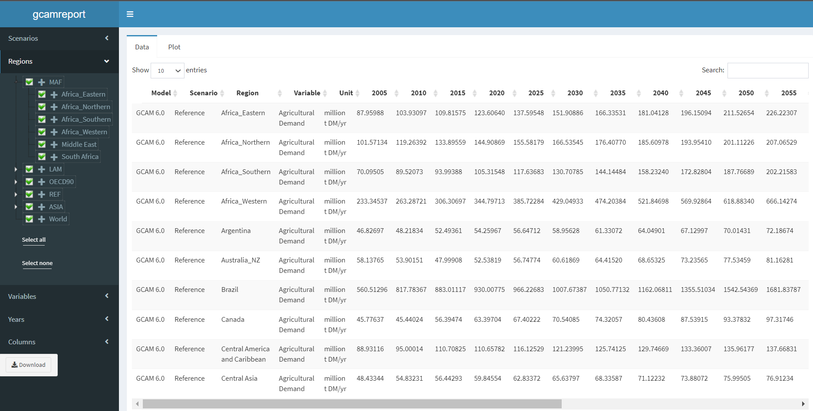
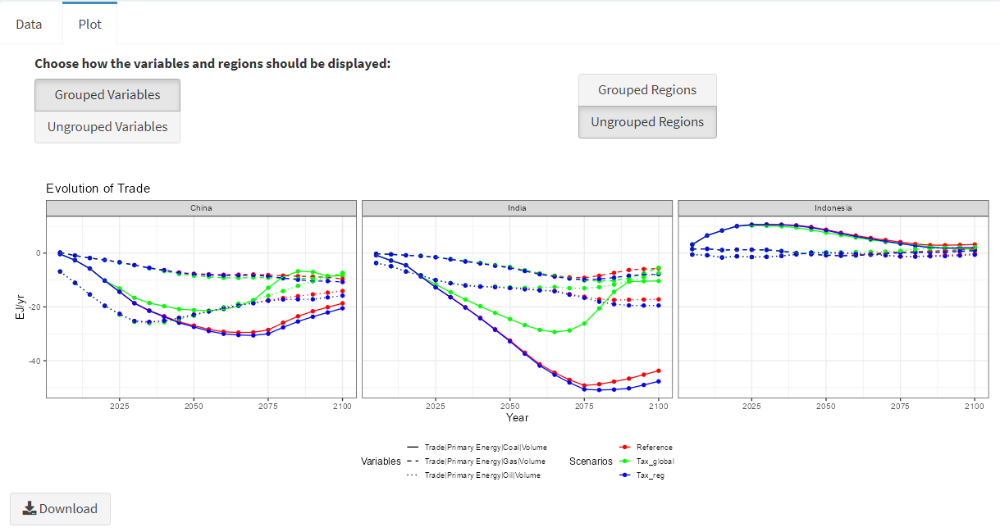

# Summary

There is an urgent need to perform multi-model studies to characterize uncertainty arising from models' heterogeneity with the aim of building a more reliable and transparent framework to inform policy makers in the design and implementation of climate policies [@guivarch_using_2022]. In response to this challenge, multiple institutes and organizations have adopted the standardized data template developed by the Integrated Assessment Modeling Consortium (IAMC). This template is maintained by the International Institute for Applied Systems Analysis (IIASA) and aims to standardize and facilitate model intercomparison exercises. For the latest Assessment Report (AR6), the Intergovernmental Panel on Climate Change (IPCC) required all contributors to homogenize their data to enable comparisons and ensure full transparency [@krey_annex_2014]. This practice has set the foundation for a new open management of the outputs in the area of global scenario analysis.  

In the case of the Global Change Analysis Model (GCAM) [@calvin2019], a well-regarded model that has been extensively used for different international and national scenario analysis, the harmonization code has never been documented nor standardized, making it difficult to reproduce outputs and hindering the transparency of results. To overcome these limitations, we have developed `gcamreport`, an R package that systematizes the transformations of GCAM outputs, generates figures to facilitate the analysis of the results, and allows user interaction with the produced outputs. Furthermore, the tool can be used embedded in a Docker image, which allows users to use the package in a virtual environment without having to install any specific software or library. Finally, each `gcamreport` release is linked to either a version of GCAM or a study in which GCAM was used, ensuring reproducibility, interoperability, accessibility, and findability, which is in line with the well-known open science principles FAIR and TRUST [@wilkinson2016; @lin2020].


{width="75%"}

The `gcamreport` package is accessible online at the public domain <https://github.com/bc3LC/gcamreport>. To run it to generate and save the dataset meeting the IAMC requirements and to launch the user interface, you can follow a detailed [step-by-step tutorial](https://bc3lc.github.io/gcamreport/articles/Step_By_Step_Full_Example.html) or this simplified code:

``` r
# install the package
remotes::install_github("bc3LC/gcamreport")
library(gcamreport)

# run the main function to produce the dataset report meeting the IAMC 
# requirements and launch the user interface
db_path <- "path/to/my-gcam-database"
db_name <- "my-gcam-database"
prj_name <- "my-project.dat"
scen_name <- "name of the GCAM scenarios"
generate_report(db_path = db_path, db_name = db_name, prj_name = prj_name, 
scenarios = scen_name, final_year = 2100, save_output = TRUE, launch_ui = TRUE)
```

The additional instructions to run the package through a Docker image and using further functionalities can be found in the [online documentation](https://bc3lc.github.io/gcamreport/) for all the release versions.

# Statement of need

Integrated assessment models (IAMs) are the dominant tools for global scenario analysis and for exploring system-wide implications of climate policies [@van_beek_anticipating_2020]. They must be transparent and open in order to be an effective instrument for informing decision making. In addition, multi-model studies should be considered to strengthen the consistency and robustness of the policy recommendations [@nikas_perspective_2021]. However, it is not always easy to compare outputs from different models, as it involves a laborious task of bringing together modeling communities with different backgrounds. To overcome these handicaps, the [IAMC](https://www.iamconsortium.org) developed a time-series data template [@huppmann2023] which has been used in prominent multi-IAM studies, such as the presentation of the Shared Socio-economic Pathways (SSPs) [@oneill2014], the design of the Representative Concentration Pathways (RCPs) [@moss2010], and the last two IPCC Assessment Reports (AR5 [@masson-delmotte_climate_2021] and AR6 [@shukla2022]), as well as the IPCC Special Report on Global Warming of 1.5&ordm;C [@masson-delmotte_ipcc_2018] and the recent climate scenarios of the Network for Greening the Financial System (NGFS) [@richters_ngfs_2022]. For these kind of assessments, it is essential that the outputs from the different models meet strict requirements and are reported in a standardized way to facilitate the comparison and multi-analysis [@skea2021].

One of the most extensively applied integrated assessment model is the Global Change Analysis Model (GCAM) [@calvin2019]. GCAM is an open-source multi-sector model developed at the Joint Global Change Research Institute ([JGCRI](https://www.pnnl.gov/projects/jgcri)) designed to explore the linkages between energy, water, land, climate, and economics within a single computational system. It enables users to explore potential what-if type futures by dividing the world in 32 geopolitical regions and running in a 5-year time step. GCAM is in continuous development, with each new version increasing its accuracy by better representing and detailing existing elements, while adding new ones and fixing old ones [@binsted2022; @sampedro2022]. Hence, the code to transform GCAM outputs into suitable outputs for model intercomparison should be adapted to each particular version/study. Otherwise, it becomes difficult to reproduce, automatize, and track changes [@stodden2018].

Here we present `gcamreport`, a powerful R-tool aligned with the principles of open science [@wilkinson2016; @lin2020], to guarantee the transparency of the produced outcomes by transforming GCAM outputs to the IAMC template requirements, making the results directly applicable to multi-IAM studies (including upcoming IPCC reports). Moreover, to overcome the limitations to reproduce the execution environment (e.g., packages or libraries), `gcamreport` is also available within a [Docker](https://www.docker.com/) image, which already contains all the required packages and facilitates the usage, ensuring interoperability and reproducibility [@boettiger2015].

Finally, to support the analysis of the model results, `gcamreport` includes a user-friendly interface that allows to visualize the standardized outputs in tabular format, allowing the user to subset the results by regions, scenarios, models, variables, and years, along with the option to download the desired results. Moreover, the `gcamreport` user interface generates plots of the selected variables within the same category, aggregated by region and/or sub-variables, which can also be downloaded for more in-depth analysis.

# Functionality

The `gcamreport` package consists of a set of functions divided into two different blocks. All functions are described in a specific [documentation](https://bc3lc.github.io/gcamreport/index.html) supplemented by detailed tutorials.

-   Dataset generation block: Transformation and saving of outputs from a created or pre-loaded GCAM database to meet the IAMC formatting requirements.
-   Interactive user block: Dataset visualization and manipulation, and figures generation.

To read the raw GCAM outputs, `gcamreport` uses [`rgcam`](https://github.com/JGCRI/rgcam). This R package is part of the GCAM-ecosystem, which is a set of complementary tools to the GCAM model that extend its functionality and facilitate data management. In particular, `rgcam` allows to both read and create a manageable data file containing the desired model outputs selected from the GCAM results database. 

For the correct performance of `gcamreport` internal functions, the package includes user-modifiable constant values and mapping files, such as regional and sectorial aggregations, as well as external files to compute additional calculations to produce some results that are beyond the regular GCAM reporting (e.g., installed capacity). These additional calculations are necessary to meet the IAMC reporting requirements (since not all models provide the same type of outputs, but often through back-on-the-envelope calculations, harmonizing outputs in this way improves the comparability of model results). Mapping files are automatically loaded and used, but they can be customized and adjusted by the user if required by a specific study as described in a detailed [R vignette](https://bc3lc.github.io/gcamreport/articles/Modify_Mapping_Template_Tutorial.html). If the mapping files or the reporting template are modified, it is recommended to save and tag the final used version to allow reusability and reproducibility.

The output generated by the functions within the *dataset generation block* consists of an RData dataset, a Comma-Separated Values (CSV) file, and a Microsoft Excel Open XML Spreadsheet (XLSX), all of which are automatically saved unless the user specifies otherwise with the `save_output` parameter. This ensures portability and format compatibility of the output [@krey_iamc_2023]. Besides, the output generated by the *interactive user block* are both CSV files and Portable Network Graphic (PNG) files, corresponding to the processed tabular data and the generated figures, which are only saved if the user clicks on the corresponding *download* button. This last block can be directly run with the RData dataset generated by the former block, avoiding the need to re-create the reporting dataset, as detailed in this [example](https://bc3lc.github.io/gcamreport/articles/Step_By_Step_Full_Example.html#example3).

(**a**)                                                          
{width="100%"}
(**b**)                                                          
{width="100%"}
**Figure 2:** Interactive user interface visualization example. In a), see a tabular example and in b) see a plotting example.


Despite the optimization, the package still requires some performing time, mostly in order to create the project file from the given database. If the project file is already given, it takes less than a minute to produce the reporting dataset.

Lastly, the package will be updated simultaneously with the official GCAM releases, promoting the reusability and transparency. To keep track of the versions, there will be a `gcamreport` release by each `GCAM` version, tagged and named as documented in this [protocol](https://bc3lc.github.io/gcamreport/articles/Version_Guide.html). In the same line, some new features are planned for next releases, such as the reporting of hydrogen or refinery investments, or the generation of other types of plots in the user interface, in order to make the package more flexible and better adaptable to the needs of the scientific community. There are also plans to integrate the package into the GCAM-ecosystem suite of tools. Combining `gcamreport` with other tools in the ecosystem (such as [gcamextractor](https://github.com/JGCRI/gcamextractor)) will allow GCAM users to obtain the model outputs in different formats, depending on their scientific needs. 

# Acknowledgements

C.R. and D.V. acknowledges financial support from the European Union's Horizon research program under grant agreement 101056306 (IAM COMPACT project).

# References
