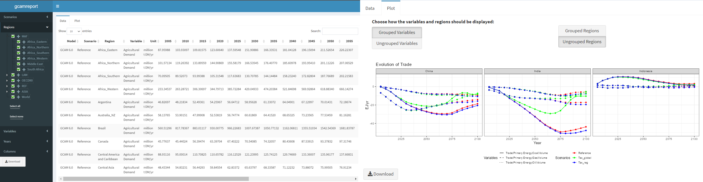

# Summary

There is an urgent need to perform multi-model studies to deal with models’ heterogeneity and uncertainty aiming to build more reliable and transparent frameworks for informing policy-makers in the design and implementation of climate policies [@guivarch_using_2022]. In response to this challenge, multiple institutes and organizations have adopted the standardized data template developed by the Integrated Assessment Modeling Consortium (IAMC). This template is maintained by the International Institute for Applied Systems Analysis (IIASA) and aims to standardize and facilitate model comparison exercises. For the latest Assessment Report (AR6), the Intergovernmental Panel on Climate Change (IPCC) required all contributors to homogenize their data in order to allow comparison and ensure complete transparency [@krey_annex_2014]. This practice has set the foundations for a new open management of the outputs in the area of global scenario analysis.  

In the case of the Global Change Analysis Model (GCAM) [@calvin2019], a well-reputed model that has been extensively used by different international and national scenario analysis, the harmonization code was never documented nor standardized, complicating the outputs reproducibility and hindering the results transparency. In order to overcome these limitations, we have developed `gcamreport`, an R package that systematizes the GCAM outputs transformation, creates figures to facilitate the analysis of the results, and allows user interaction with the produced outputs. Moreover, the tool can be used embedded in a Docker image, which enables users to run the tool in a virtual environment with no need to install any specific software or library. Finally, each `gcamreport` release is linked either to a GCAM version or to a study where GCAM was used, ensuring reproducibility, interoperability, accessibility, and findability, which is in line with the well-known open science principles FAIR and TRUST [@wilkinson2016; @lin2020].


{width="75%"}

`gcamreport` package is accessible online at the public domain <https://github.com/bc3LC/gcamreport>. To run to generate and save the dataset meeting the IAMC requirements and to launch the user interface, you can follow this simplified code:

``` r
# install the package
remotes::install_github("bc3LC/gcamreport")
library(gcamreport)

# run the main function with all the funcionalities integrated
run(project_path = awesomeProject.dat, final_year = 2100, save_output = TRUE, launch_ui = TRUE)
```

The additional instructions to run the package through a Docker image and with further functionalities can be found in the [online documentation](https://bc3lc.github.io/gcamreport/#with-docker)


# Statement of need

Integrated assessment models (IAMs) are the dominant tools for global scenario analysis and to explore system-wide implications of climate policies [@van_beek_anticipating_2020]. They must be transparent and open in order to be an effective instrument for informing decision-making processes, and it is desirable to take multi-model studies into account in order to strengthen the consistency and robustness of the policy recommendations [@nikas_perspective_2021]. However, it is not always easy to compare outputs from different models, as it involves a laborious task of bringing together modeling communities with different backgrounds. To overcome these handicaps, the [IAMC](https://www.iamconsortium.org) developed a time-series data template [@huppmann2023] which has been used in distinguished multi-IAM studies, such as the presentation of the Shared Socio-economic Pathways (SSPs) [@oneill2014], the design of the Representative Concentration Pathways (RCPs) (Moss et al., 2010), and the last two IPCC Assessment Reports (AR5 [@masson-delmotte_climate_2021] and AR6 [@shukla2022]), as well as the IPCC Special Report on Global Warming of 1.5ºC [@masson-delmotte_ipcc_2018] and the recent Network for Greening the Financial System (NGFS) Climate Scenarios [@richters_ngfs_2022]. For this kind of assessments, it is essential that the outputs from the different models meet strict requirements and are reported in a standardized way, facilitating the comparison and multi-analysis [@skea2021].

One of the most extensively applied integrated assessment model is the Global Change Analysis Model (GCAM) [@calvin2019]. GCAM is an open-source multi-sector model developed at the Joint Global Change Research Institute ([JGCRI](https://www.pnnl.gov/projects/jgcri)) designed to explore the linkages between energy, water, land, climate, and economic within a single computational system. It enables users to explore potential what-if type futures dividing the world in 32 geopolitical regions and running in a 5-year time step. GCAM is in continuous development, with each new version increasing its precision by representing and detailing better already-existing items, while incorporating new ones and fixing old features [@binsted2022; @sampedro2022]. Hence, the code to transform a GCAM output to a suitable output for model intercomparison should be adapted to each particular version/study. Otherwise, it becomes difficult to reproduce, automatize, and track changes [@stodden2018].

Therefore, `gcamreport` is a powerful R-tool, aligned with the principles of open science [@wilkinson2016; @lin2020], to guarantee the transparency of the produced outcomes by transforming GCAM outputs to the IAMC template requirements, which makes the results directly applicable to multi-IAM studies (including upcoming IPCC reports). Moreover, to overcome the limitations to reproduce the execution environment (e.g., packages or libraries), `gcamreport` is also available within a [Docker](https://www.docker.com/) image, which already contains all the required packages and facilitates the usage, ensuring interoperability and reproducibility [@boettiger2015]..

Finally, to support the analysis of the model results, `gcamreport` contains a user-friendly interface that allows to visualize the standardized output in table format, enabling the user to subset the results by regions, scenarios, models, variables, and years, along with the choice to download the desired outcomes. Moreover, `gcamreport` user interface creates plots of the selected variables within the same category, aggregating them by region and/or sub-variables, which can also be downloaded to perform in depth analyses.


# Functionality

The `gcamreport` package consists of a set of functions divided into two different blocks. All functions are described in a specific [documentation](https://bc3lc.github.io/gcamreport/index.html) supplemented by some tutorials.

-   Dataset generation block: Transformation and saving of outputs from a created or pre-loaded GCAM database to meet the IAMC formatting requirements.
-   Interactive user block: Dataset visualization and manipulation, and production of figures.

To read the raw GCAM outputs, `gcamreport` uses [`rgcam`](https://github.com/JGCRI/rgcam). This R-package is part of the GCAM-ecosystem, which is a set of complementary tools of the GCAM model that expand its functionalities and facilitate the data management. In particular, `rgcam` allows to both read and create a manageable data file that contains the desired model outputs selected from the GCAM results database. 

For the correct performance of `gcamreport` internal functions, the package contains user-modifiable constant values and mapping files, such as regional and sectoral aggregations, and external files to compute additional calculations to produce some results that are beyond regular GCAM reporting (e.g., installed capacity). These additional calculations are necessary to meet the IAMC reporting requirements (since not all models provide the same type of outputs, but often through back-on-the-envelope calculations, harmonizing outputs in this way improve the comparability of model results). Mapping files are automatically loaded and used, but they can be adjusted by the user if the specific study or GCAM version requires it. In this case, it is recommended to save and tag the final version used to allow reusability and reproducibility.

The output generated by the functions within the *dataset generation block* consist of a Comma-Separated Values (CSV) file and a Microsoft Excel Open XML Spreadsheet (XLSX), which are both automatically saved unless the user specifies the contrary through the parameter save_output. In this way the portability and format compatibility of the outputs is ensured [@krey_iamc_2023]. Besides, the outputs generated by the *interactive user block* are both CSV files and Portable Network Graphic (PNG) files, corresponding to the processed tabular data and the created figures, which are only saved if the user clicks the corresponding *download* button.

{width="100%"}

Lastly, the package will be updated simultaneously to the official GCAM releases, promoting the reusability and transparency. In the same line, some new features are planned for next editions; for instance, to report hydrogen or refining investments, or to produce other kind of plots in the user interface aiming to make the package more flexible and to adapt better to the needs of the scientific community. Moreover, the plan is to integrate the package within the GCAM-ecosystem suite of tools. Combining `gcamreport` with other tools in the ecosystem (such as [gcamextractor](https://github.com/JGCRI/gcamextractor) will allow GCAM users to get the model outputs in different formats, depending on their scientific needs. 
# Acknowledgements

C.R. and D.V. acknowledges financial support from the European Union's Horizon research program under grant agreement 101056306 (IAM COMPACT project).

# References
